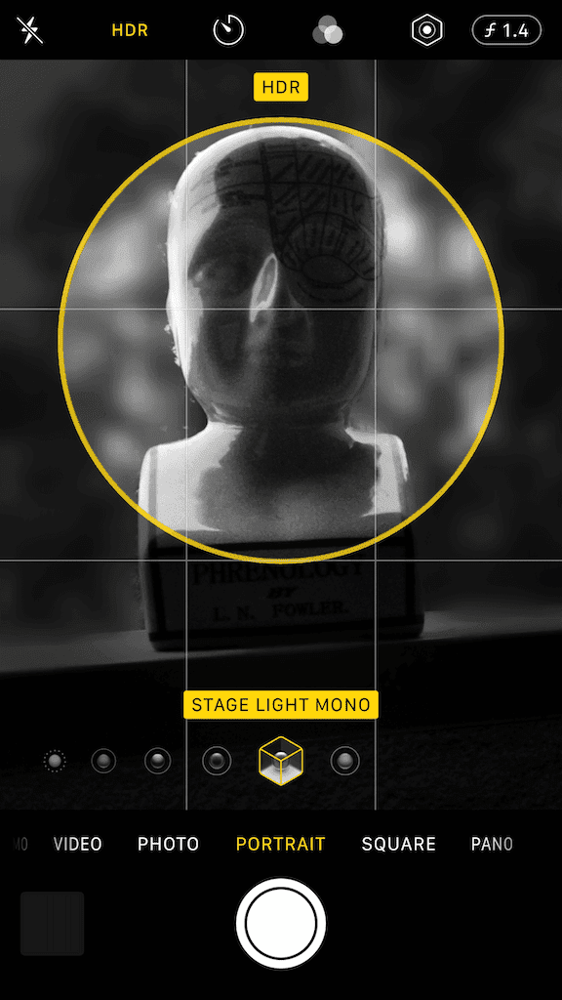
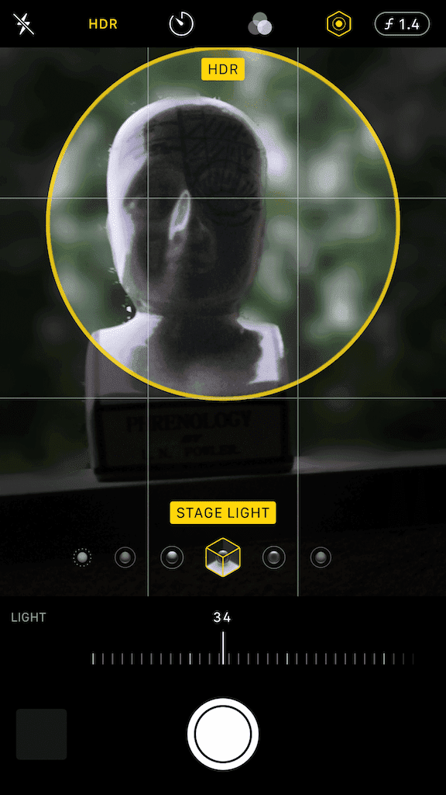
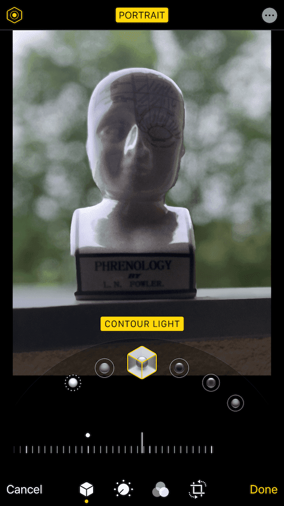
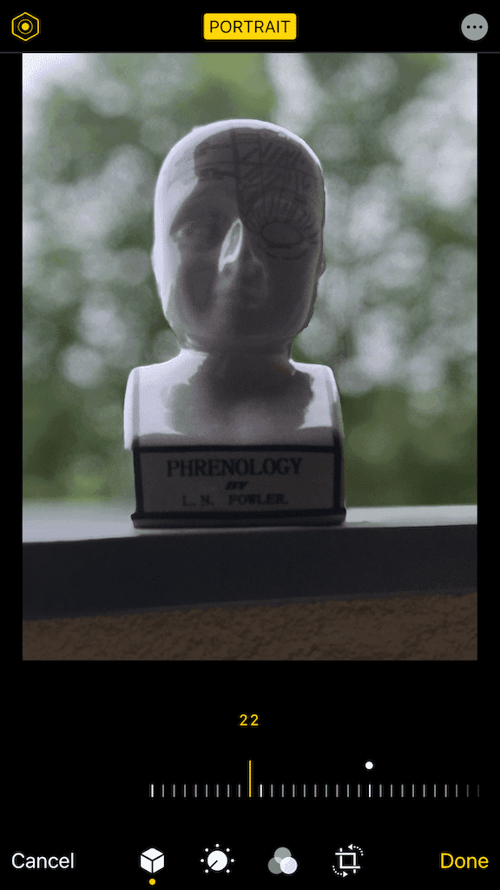

#Enable all Portrait Lightning effects in Camera app and Photos app (while editing Portrait photos).

##Requires dual camera phones and iOS greater or equal to 13.4.

##In Camera app this tweak enables Lightning effects:
- Natural Light: The face is in sharp focus against a blurred background.
- Studio Light: The face is brightly lit, and the photo has an overall clean look.
- Contour Light: The face has dramatic shadows with highlights and lowlights.
- Stage Light: The face is spotlit against a deep black background.
- Stage Light Mono: The effect is like Stage Light, but the photo is in classic black and white.
- High-Key Light Mono: Creates a grayscale subject on a white background
- Lightning effects intensity control
- Depth Control

##In Photos app this tweak enables Lightning effects (while editing Portrait photos):
- Natural Light: The face is in sharp focus against a blurred background.
- Studio Light: The face is brightly lit, and the photo has an overall clean look.
- Contour Light: The face has dramatic shadows with highlights and lowlights.
- Stage Light: The face is spotlit against a deep black background.
- Stage Light Mono: The effect is like Stage Light, but the photo is in classic black and white.
- High-Key Light Mono: Creates a grayscale subject on a white background
- Lightning effects intensity control

##Camera app Screenshots:

##Photos app Screenshots:

